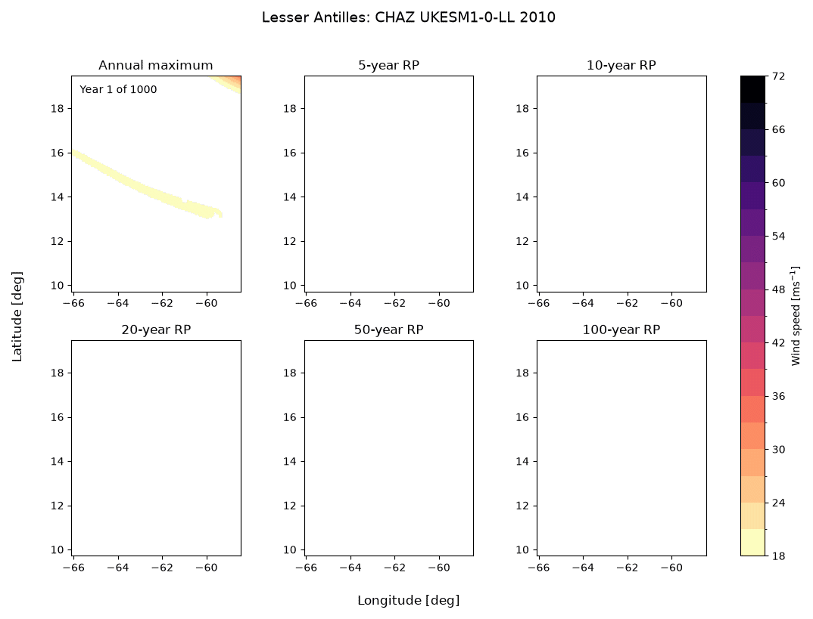

# malkus

`malkus` is a Python library for turning tropical-cyclone track catalogues into
wind-hazard footprints and return-period maps. It provides tools for validating
track data, interpolating storm motion, evaluating wind fields, applying
surface-roughness downscaling, and exporting hazard maps.



## Installation

To use, please install [pixi](https://pixi.prefix.dev/) and run:

```bash
pixi install
```

## Example

Tracks are read from Parquet or GeoParquet into a validated `TrackSet`. One can
then compute wind fields and return-period hazard maps.

Track inputs should contain the canonical fields required by `TrackSet`,
including track ID, UTC timestamp, latitude, longitude, maximum wind speed,
radius to maximum winds, and minimum pressure.

The following illustrates the core workflow:

```python
from malkus import (
    RegularGrid,
    SurfaceRoughness,
    TrackSet,
    TrackSource,
    compute_winds,
    downscale_winds,
    initialize_wind_footprints,
    return_period_maps,
)

bounds = (56.2, -21.8, 59.1, -18.9)  # west, south, east, north
grid = RegularGrid.from_bbox(bounds, resolution=0.1)
trackset = TrackSet.read_parquet(
    "tracks.geoparquet",
    source=TrackSource.EMANUEL,
)
wind_footprints = compute_winds(
    trackset,
    grid,
    interpolation_frequency="30min",
)
```

The `footprints` object is then a `WindFootprintSet`, an xarray Dataset with
additional metadata.

We can downscale these footprints with a surface roughness technique.

```python
footprints_store = initialize_wind_footprints(
    "footprints.zarr",
    trackset,
    grid,
)
surface_roughness = SurfaceRoughness(
    land_cover_path=land_cover_path,
    mapping_path=mapping_path,
)
downscaled_footprints = downscale_winds(
    wind_footprints,
    method=surface_roughness,
    output=footprints_store
)
```

And lastly, find the annual maxima and produce wind speed exceedance maps for
given return periods. These can be written to disk as Zarr and/or sets of
GeoTIFFs.

```python
rp_maps = return_period_maps(
    downscaled_footprints,
    return_periods=[5, 10, 20, 50, 100],
    output="rp-maps.zarr",
)
rp_maps.write_geotiffs("rp-maps")
```

For a complete example, see [`scripts/trackset_to_rp_maps.py`](scripts/trackset_to_rp_maps.py).

## Development

Run the test suite with:

```bash
pixi run python -m pytest -q
```

The project supports Python 3.12 and newer.
